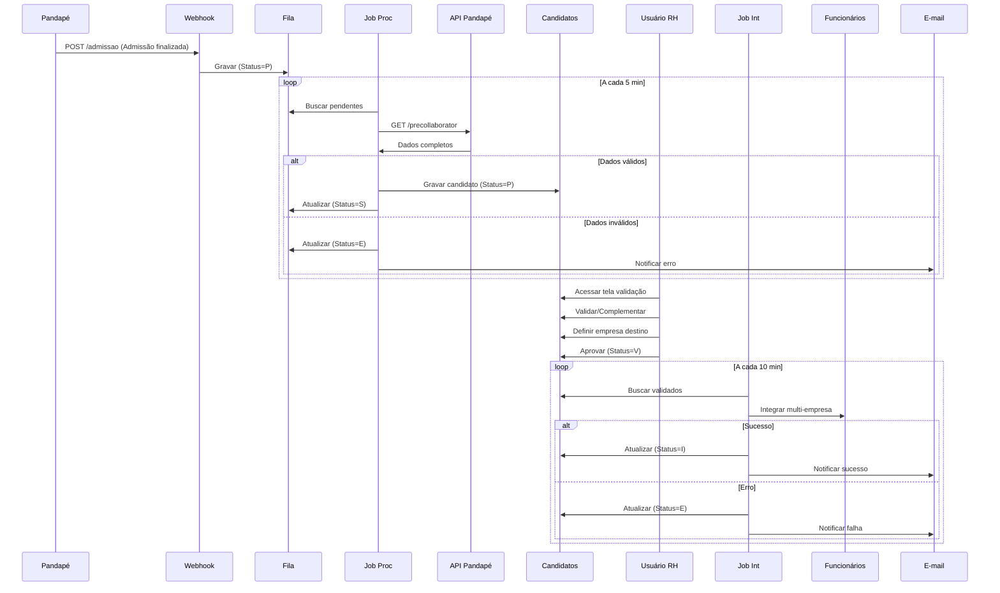

# Documento Técnico - Integração Pandapé x Protheus RH

**Versão:** 4.0  
**Data:** 24/09/2025  
**Autor:** Daniel Ribeiro de Oliveira  
**Status:** Em Desenvolvimento  
**Última Atualização:** Reestruturação completa do processo sem módulo R&S padrão

---

## 📋 Sumário

1. [Visão Geral](#1-visão-geral)
2. [Arquitetura da Solução](#2-arquitetura-da-solução)
3. [Estruturas de Dados](#3-estruturas-de-dados)
4. [Componentes do Sistema](#4-componentes-do-sistema)
5. [Fluxo de Processamento](#5-fluxo-de-processamento)
6. [Interface de Usuário](#6-interface-de-usuário)
7. [Tratamento de Erros e Notificações](#7-tratamento-de-erros-e-notificações)
8. [Monitoramento e Logs](#8-monitoramento-e-logs)
9. [Configurações e Parâmetros](#9-configurações-e-parâmetros)
10. [Cronograma de Implementação](#10-cronograma-de-implementação)
11. [Anexos](#11-anexos)

---

## 1. Visão Geral

### 1.1 Contexto
Com a descontinuação do módulo de Recrutamento e Seleção do Protheus, surge a necessidade de implementar um processo customizado completo para integração de candidatos do Pandapé diretamente com o módulo de RH (tabela SRA).

### 1.2 Objetivo
Desenvolver solução completa de integração entre Pandapé e Protheus RH que permita:
- Recepção automatizada de candidatos aprovados via webhook
- Validação e complementação de dados por usuários de RH
- Integração multi-empresa com controle total do processo
- Notificações automáticas de falhas e pendências

### 1.3 Escopo Funcional
- **Entrada**: Webhook "Admissão finalizada" do Pandapé
- **Processamento**: Validação e enriquecimento de dados
- **Interface**: Tela MVC para gestão de candidatos
- **Saída**: Funcionários criados na SRA (multi-empresa)
- **Monitoramento**: E-mails automáticos e logs detalhados

### 1.4 Benefícios
- **Automação**: Redução de 90% do trabalho manual
- **Controle**: Visibilidade completa do pipeline
- **Flexibilidade**: Seleção de empresa destino
- **Rastreabilidade**: Histórico completo de ações
- **Confiabilidade**: Notificações proativas de problemas

---

## 2. Arquitetura da Solução

### 2.1 Visão Macro do Processo

```
┌─────────────────┐       ┌──────────────────┐       ┌─────────────────┐
│     Pandapé     │──────►│   Webhook REST   │──────►│   Tabela ZPA    │
│  (Admissão OK)  │       │   /admissao      │       │     (Fila)      │
└─────────────────┘       └──────────────────┘       └─────────────────┘
                                                              │
                                                              ▼
┌─────────────────┐       ┌──────────────────┐       ┌─────────────────┐
│  Notificações   │◄──────│   Job Processa   │──────►│  API Pandapé    │
│    E-mail       │       │    PPJOBPROC     │       │  (Busca dados)  │
└─────────────────┘       └──────────────────┘       └─────────────────┘
                                   │
                                   ▼
                          ┌──────────────────┐
                          │   Tabela ZPC     │
                          │  (Candidatos)    │
                          └──────────────────┘
                                   │
                                   ▼
┌─────────────────┐       ┌──────────────────┐       ┌─────────────────┐
│   Interface     │──────►│  Validação RH    │──────►│   Tabela ZPV    │
│   MVC (Tela)    │       │  (Complementa)   │       │  (Validações)   │
└─────────────────┘       └──────────────────┘       └─────────────────┘
                                   │
                                   ▼
┌─────────────────┐       ┌──────────────────┐       ┌─────────────────┐
│  Multi-Empresa  │──────►│  Job Integração  │──────►│   Tabela SRA    │
│   Seleção       │       │    PPJOBINT      │       │  (Funcionários) │
└─────────────────┘       └──────────────────┘       └─────────────────┘
                                   │
                                   ▼
                          ┌──────────────────┐
                          │   Tabela ZPI     │
                          │  (Log Integr.)   │
                          └──────────────────┘
```

### 2.2 Componentes Principais

| Componente | Tipo | Responsabilidade |
|------------|------|------------------|
| **PandapeWebhook** | REST API | Receber webhooks de admissão |
| **PANDAPE** | Classe TLPP | Consumir APIs do Pandapé |
| **PPJOBPROC** | Job TLPP | Processar fila e buscar dados |
| **PPVALCAND** | MVC TLPP | Interface de validação |
| **PPJOBINT** | Job TLPP | Integrar candidatos aprovados |
| **PPNOTIFICA** | Classe TLPP | Enviar notificações e-mail |

---

## 3. Estruturas de Dados

### 3.1 ZPA - Fila de Webhooks (Existente - Mantida)

| Campo | Tipo | Tam | Descrição |
|-------|------|-----|-----------|
| ZPA_FILIAL | C | 2 | Filial do sistema |
| ZPA_ID | C | 10 | ID único (GetSxeNum) |
| ZPA_IDMATC | C | 15 | ID do match Pandapé |
| ZPA_IDPREC | C | 15 | ID do pré-colaborador |
| ZPA_IDVAGA | C | 15 | ID da vaga |
| ZPA_ETAPA | C | 30 | Etapa (Admissão finalizada) |
| ZPA_JSON | M | - | Payload completo |
| ZPA_STATUS | C | 1 | P=Pendente S=Sucesso E=Erro |
| ZPA_DTINCL | D | 8 | Data inclusão |
| ZPA_HRINCL | C | 8 | Hora inclusão |
| ZPA_TENTAT | N | 2 | Tentativas processamento |
| ZPA_MSGERR | M | - | Mensagem de erro |

### 3.2 ZPC - Candidatos para Validação (Nova)

| Campo | Tipo | Tam | Descrição |
|-------|------|-----|-----------|
| ZPC_FILIAL | C | 2 | Filial do sistema |
| ZPC_ID | C | 10 | ID único (GetSxeNum) |
| ZPC_IDZPA | C | 10 | ID origem na ZPA |
| ZPC_IDMATC | C | 15 | ID match Pandapé |
| ZPC_CPF | C | 11 | CPF do candidato |
| ZPC_NOME | C | 60 | Nome completo |
| ZPC_DTNASC | D | 8 | Data nascimento |
| ZPC_SEXO | C | 1 | M/F |
| ZPC_EMAIL | C | 60 | E-mail |
| ZPC_FONE | C | 15 | Telefone |
| ZPC_CEP | C | 8 | CEP |
| ZPC_ENDERE | C | 60 | Endereço |
| ZPC_NUMERO | C | 10 | Número |
| ZPC_COMPLE | C | 30 | Complemento |
| ZPC_BAIRRO | C | 30 | Bairro |
| ZPC_CIDADE | C | 30 | Cidade |
| ZPC_UF | C | 2 | Estado |
| ZPC_ESTCIV | C | 1 | Estado civil |
| ZPC_VAGA | C | 60 | Descrição da vaga |
| ZPC_DEPTO | C | 30 | Departamento sugerido |
| ZPC_FUNCAO | C | 30 | Função sugerida |
| ZPC_SALARI | N | 12,2 | Salário proposto |
| ZPC_STATUS | C | 1 | Status validação |
| ZPC_EMPDES | C | 2 | Empresa destino |
| ZPC_FILDES | C | 2 | Filial destino |
| ZPC_DTINCL | D | 8 | Data inclusão |
| ZPC_HRINCL | C | 8 | Hora inclusão |
| ZPC_JSONAD | M | - | JSON adicional Pandapé |

**Status ZPC_STATUS:**
- P = Pendente validação
- V = Validado (pronto para integrar)
- I = Integrado com sucesso
- E = Erro na integração
- R = Rejeitado pelo RH

### 3.3 ZPV - Log de Validações (Nova)

| Campo | Tipo | Tam | Descrição |
|-------|------|-----|-----------|
| ZPV_FILIAL | C | 2 | Filial do sistema |
| ZPV_ID | C | 10 | ID único (GetSxeNum) |
| ZPV_IDZPC | C | 10 | ID do candidato |
| ZPV_DATA | D | 8 | Data da ação |
| ZPV_HORA | C | 8 | Hora da ação |
| ZPV_USUARI | C | 15 | Código do usuário |
| ZPV_NOMEUS | C | 40 | Nome do usuário |
| ZPV_ACAO | C | 1 | Tipo de ação |
| ZPV_OBSERV | M | - | Observações |
| ZPV_CAMPOS | M | - | Campos alterados (JSON) |

**Ações ZPV_ACAO:**
- V = Validação
- A = Alteração de dados
- R = Rejeição
- I = Integração
- E = Erro

### 3.4 ZPI - Log de Integrações (Nova)

| Campo | Tipo | Tam | Descrição |
|-------|------|-----|-----------|
| ZPI_FILIAL | C | 2 | Filial do sistema |
| ZPI_ID | C | 10 | ID único (GetSxeNum) |
| ZPI_IDZPC | C | 10 | ID do candidato |
| ZPI_CPF | C | 11 | CPF do candidato |
| ZPI_NOME | C | 60 | Nome do candidato |
| ZPI_EMPORI | C | 2 | Empresa origem |
| ZPI_FILORI | C | 2 | Filial origem |
| ZPI_EMPDES | C | 2 | Empresa destino |
| ZPI_FILDES | C | 2 | Filial destino |
| ZPI_MATRIC | C | 6 | Matrícula gerada |
| ZPI_STATUS | C | 1 | S=Sucesso E=Erro |
| ZPI_DTINTE | D | 8 | Data integração |
| ZPI_HRINTE | C | 8 | Hora integração |
| ZPI_MSGERR | M | - | Mensagem erro |
| ZPI_USUARI | C | 15 | Usuário executou |

### 3.5 Índices das Tabelas

**ZPA:**
- Índice 1: ZPA_FILIAL + ZPA_ID (Único)
- Índice 2: ZPA_FILIAL + ZPA_STATUS + ZPA_DTINCL
- Índice 3: ZPA_FILIAL + ZPA_IDPREC

**ZPC:**
- Índice 1: ZPC_FILIAL + ZPC_ID (Único)
- Índice 2: ZPC_FILIAL + ZPC_CPF
- Índice 3: ZPC_FILIAL + ZPC_STATUS
- Índice 4: ZPC_FILIAL + ZPC_EMPDES + ZPC_FILDES

**ZPV:**
- Índice 1: ZPV_FILIAL + ZPV_ID (Único)
- Índice 2: ZPV_FILIAL + ZPV_IDZPC + ZPV_DATA + ZPV_HORA

**ZPI:**
- Índice 1: ZPI_FILIAL + ZPI_ID (Único)
- Índice 2: ZPI_FILIAL + ZPI_IDZPC
- Índice 3: ZPI_FILIAL + ZPI_EMPDES + ZPI_MATRIC

---

## 4. Componentes do Sistema

### 4.1 PandapeWebhook.tlpp (Existente - Mantido)

```tlpp
namespace pandape.webhook

class PandapeWebhook from FwAdapterBaseV2
    @post('/pandape/webhook/admissao')
    public method receberWebhook() as logical
endclass
```

**Responsabilidades:**
- Receber POST do Pandapé
- Validar payload
- Filtrar apenas "Admissão finalizada"
- Gravar na ZPA

### 4.2 PANDAPE.tlpp (Existente - Adaptado)

```tlpp
namespace pandape.api

class PANDAPE
    public method authenticate() as logical
    public method getPreCollaborator(cId) as json
    public method getMatch(cId) as json
    public method getVacancy(cId) as json
endclass
```

**Adaptações necessárias:**
- Adicionar método para buscar formulários de admissão
- Melhorar tratamento de erros HTTP
- Implementar cache de token

### 4.3 PPJOBPROC.tlpp (Reformulado)

**Nova lógica:**
1. Buscar registros pendentes na ZPA
2. Para cada registro:
   - Autenticar na API Pandapé
   - Buscar dados completos (Match + PreCollaborator)
   - Validar CPF, Nome (obrigatórios)
   - Gravar na ZPC com status 'P'
   - Atualizar ZPA com sucesso/erro
3. Enviar e-mail consolidado de erros

### 4.4 PPVALCAND.tlpp (Novo - Interface MVC)

**Funcionalidades da tela:**
- Browse com filtros por status
- Validação individual ou em lote
- Seleção de empresa/filial destino
- Complementação de dados faltantes
- Visualização de histórico
- Reprocessamento de erros

### 4.5 PPJOBINT.tlpp (Novo - Job Integração)

**Processo de integração:**
1. Buscar candidatos validados (ZPC_STATUS = 'V')
2. Para cada candidato:
   - Trocar para empresa/filial destino
   - Gravar na SRA
   - Atualizar status ZPC
   - Registrar em ZPI
   - Enviar notificação

### 4.6 PPNOTIFICA.tlpp (Novo - Notificações)

**Templates de e-mail:**
- Erro no job de processamento
- Candidatos pendentes de validação
- Integração realizada com sucesso
- Falha na integração

---

## 5. Fluxo de Processamento

### 5.1 Fluxo Principal Detalhado



### 5.2 Estados do Candidato

```
[Webhook] -> [ZPA:Pendente] -> [ZPA:Processando] -> [ZPC:Pendente]
                     |                                      |
                     v                                      v
                [ZPA:Erro]                          [ZPC:Validado]
                     |                                      |
                [E-mail]                                    v
                                                    [ZPC:Integrado]
                                                           |
                                                           v
                                                      [SRA:Ativo]
```

---

## 6. Interface de Usuário

### 6.1 Tela Principal - Browse

```
╔══════════════════════════════════════════════════════════════╗
║  Validação de Candidatos - Pandapé                          ║
╠══════════════════════════════════════════════════════════════╣
║ [Pesquisar] [Validar] [Rejeitar] [Integrar] [Histórico]    ║
╠══════════════════════════════════════════════════════════════╣
║ Filtros: [Status: Todos v] [Período: Últimos 7 dias v]      ║
╠══════════════════════════════════════════════════════════════╣
║ ● | CPF         | Nome           | Vaga      | Status | Emp ║
║ ---|-------------|----------------|-----------|---------|-----║
║ 🟡 | 12345678901 | João Silva     | Analista  | Pend.   | -- ║
║ 🔵 | 98765432109 | Maria Santos   | Gerente   | Valid.  | 01 ║
║ 🟢 | 45678912345 | Pedro Costa    | Operador  | Integr. | 03 ║
╚══════════════════════════════════════════════════════════════╝
```
---

## 7. Tratamento de Erros e Notificações

### 7.1 Matriz de Erros (Exemplos)

| Código | Tipo | Descrição | Ação | Notificação |
|--------|------|-----------|------|-------------|
| E001 | API | Timeout na autenticação | Retry 3x | E-mail após 3ª falha |
| E002 | API | Candidato não encontrado | Marcar erro | E-mail imediato |
| E003 | Validação | CPF inválido | Log erro | E-mail consolidado |
| E004 | Validação | Nome ausente | Log erro | E-mail consolidado |
| E005 | Integração | Matrícula duplicada | Rollback | E-mail imediato |
| E006 | Integração | Empresa não existe | Cancelar | E-mail imediato |
| E007 | Sistema | Tabela travada | Retry 5x | E-mail após 5ª falha |

### 7.2 Templates de E-mail

**Erro no Processamento:**
```html
Assunto: [PANDAPÉ] Erro no processamento de candidatos

Prezado(a) Gestor(a) de RH,

Identificamos erros no processamento dos seguintes candidatos:

1. João Silva (CPF: 123.456.789-01)
   Erro: Dados incompletos na API Pandapé
   Data/Hora: 24/09/2025 14:30:15

2. Maria Santos (CPF: 987.654.321-09)
   Erro: CPF inválido
   Data/Hora: 24/09/2025 14:35:22

Total de erros: 2
Candidatos processados com sucesso: 8

Acesse o sistema para mais detalhes.
```

---

## 8. Monitoramento e Logs

### 8.1 Estrutura de Logs

```
[DATA] [HORA] [COMPONENTE] [NIVEL] [USUARIO] [ACAO] - MENSAGEM
```

Exemplos:
```
[2025-09-24] [14:30:15] [WEBHOOK] [INFO] [SYSTEM] [RECEBIDO] - Candidato 245644 etapa Admissão finalizada
[2025-09-24] [14:30:20] [PPJOBPROC] [INFO] [JOB] [PROCESSANDO] - Iniciando lote de 5 registros
[2025-09-24] [14:30:45] [PPJOBPROC] [SUCCESS] [JOB] [GRAVADO] - Candidato João Silva gravado na ZPC
[2025-09-24] [15:15:10] [PPVALCAND] [INFO] [USER001] [VALIDADO] - Candidato João Silva aprovado para empresa 01
[2025-09-24] [15:20:00] [PPJOBINT] [SUCCESS] [JOB] [INTEGRADO] - João Silva matrícula 000123 empresa 01
```
---

## 9. Configurações e Parâmetros

### 9.1 Parâmetros do Sistema

| Parâmetro | Tipo | Tam | Descrição | Padrão |
|-----------|------|-----|-----------|--------|
| MV_PANDCLI | C | 50 | Client ID API Pandapé | "PronutriPremiumRefeicoesApiClient" |
| MV_PANDSEC | C | 50 | Secret API Pandapé | "9216cab101494fd9ad72" |
| MV_PANDURL | C | 100 | URL base API Pandapé | "https://api.pandape.com.br" |
| MV_PANDAUT | C | 100 | URL autenticação | "https://login.pandape.com.br" |
| MV_PANDJOB | L | 1 | Habilita job processamento | .T. |
| MV_PANDINT | N | 3 | Intervalo job proc (min) | 5 |
| MV_PANDINI | N | 3 | Intervalo job integ (min) | 10 |
| MV_PANDLOT | N | 3 | Tamanho lote | 50 |
| MV_PANDRET | N | 2 | Máximo tentativas | 3 |
| MV_PANDDEB | L | 1 | Debug ativado | .F. |
| MV_PANDEML | C | 200 | E-mails notificação | "rh@empresa.com.br" |
| MV_PANDEMF | L | 1 | Enviar e-mail falhas | .T. |
| MV_PANDEMP | L | 1 | Enviar e-mail pendentes | .T. |
| MV_PANDPHR | N | 2 | Horas para alerta pendente | 48 |

---

## 10. Cronograma de Implementação

### Fase 1: Preparação - Semana 1 (24-28/09)
- [x] Análise do processo atual
- [x] Documentação técnica
- [ ] Criação tabelas ZPC, ZPV, ZPI
- [ ] Configuração de índices 
- [ ] Revisão parâmetros MV_PAND*

### Fase 2: Backend - Semana 2 (01-05/10)
- [ ] Adaptar PPJOBPROC para ZPC
- [ ] Desenvolver PPJOBINT
- [ ] Implementar PPNOTIFICA
- [ ] Testes unitários backend
- [ ] Logs estruturados

### Fase 3: Interface - Semana 3 (08-12/10)
- [ ] Desenvolver MVC PPVALCAND
- [ ] Tela de validação
- [ ] Tela de histórico
- [ ] Seleção multi-empresa
- [ ] Testes interface

### Fase 4: Integração - Semana 4 (15-19/10)
- [ ] Testes integrados
- [ ] Ajustes performance
- [ ] Documentação usuário
- [ ] Treinamento equipe RH
- [ ] Simulação completa

### Fase 5: Homologação - Semana 5 (22-26/10)
- [ ] Deploy homologação
- [ ] Testes com dados reais
- [ ] Validação com RH
- [ ] Ajustes finais
- [ ] Aprovação

### Fase 6: Produção - Semana 6 (29/10-02/11)
- [ ] Deploy produção
- [ ] Monitoramento intensivo
- [ ] Suporte pós-deploy
- [ ] Ajustes finos
- [ ] Documentação final

---

**Documento Técnico Completo**  
**Versão:** 4.0  
**Data:** 24/09/2025  
**Status:** Pronto para Implementação

**Controle de Versões:**
- v1.0: Integração inicial com módulo R&S
- v2.0: Ajustes para tabelas específicas
- v3.0: Decisão sobre estrutura de dados
- v4.0: Reestruturação completa sem R&S + Multi-empresa

**Próximos Passos:**
1. Aprovação da arquitetura pelo time técnico
2. Criação das tabelas no ambiente de desenvolvimento
3. Início do desenvolvimento conforme cronograma
4. Validação com equipe de RH

**Contato Técnico:**
- Autor: Daniel Ribeiro de Oliveira
- E-mail: daniel.oliveira@empresa.com.br
- Equipe: Desenvolvimento Protheus
